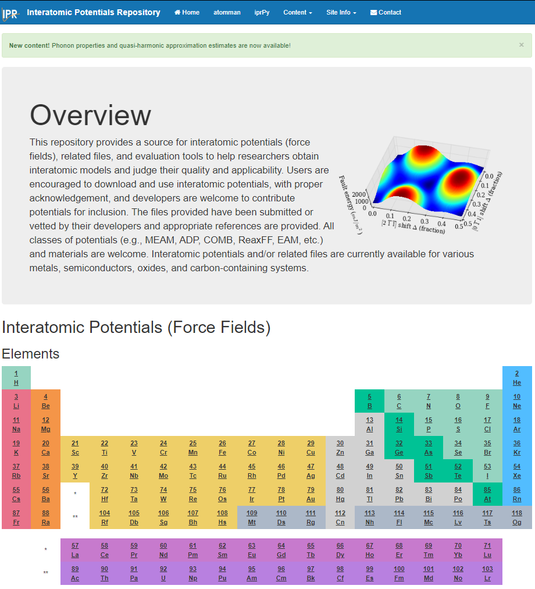
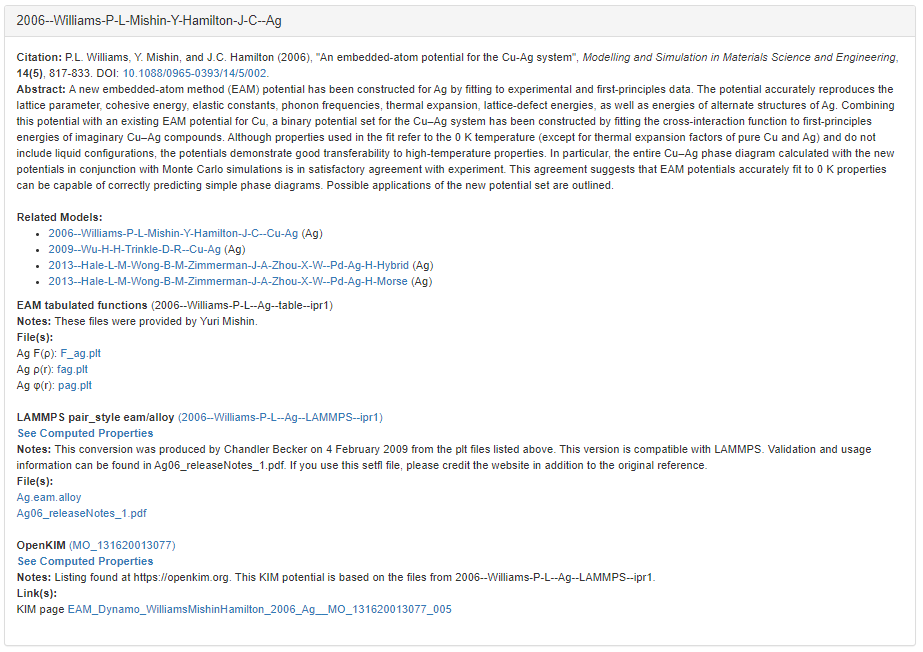
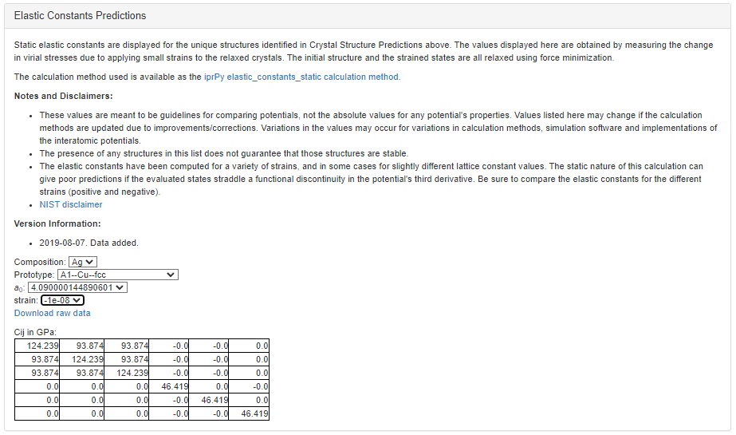
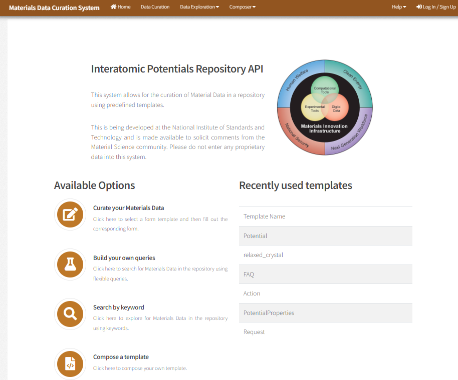
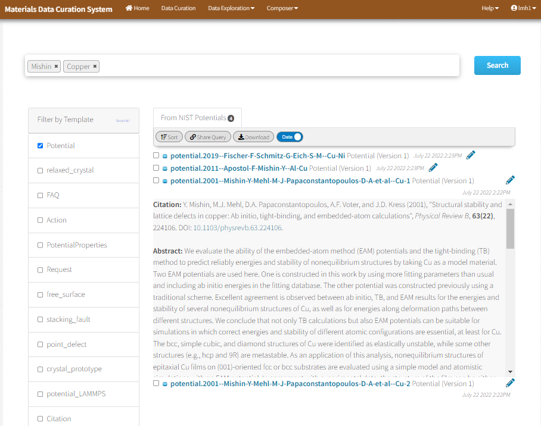
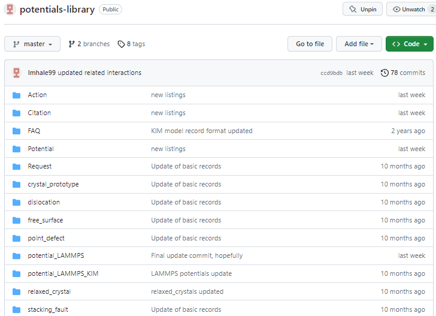

# Getting Interatomic Potentials from the NIST Interatomic Potentials Repository

The NIST Interatomic Potentials Repository serves as host for community-developed interatomic potentials that primarily focus on representing crystalline materials. The project aims to make it easy for users to discover, download, compare and use existing classical interatomic potentials.

## 1. Interatomic Potentials Repository

The Interatomic Potentials Repository is a website that can be visited at https://www.ctcms.nist.gov/potentials/.

- - -

If you click on an element or elemental system, it will bring up a list of all hosted interatomic potentials that offer models for that element. Each listing can provide the following information
- Each potential has a unique ID.
- Citation information including abstract(s).
- A list of related models that share the same or nearly the same interactions.
- General usage notes about the potential, such as what it was originally designed for.
- A list of known hosted implementations.
    - Each implementation has a unique ID.
    - Notes on where the files originated and any conversion/validation notes if needed.
    - Downloadable links to the parameter files and/or web links to external sites where the content is hosted.
    - For LAMMPS-compatible potentials, a "See Computed Properties" link to view computed properties.    

- - -

__If you wish to submit potentials to the repository__ just email potentials@nist.gov.  The repository primarily serves as an archive of parameter files, but we can also build registry-style entries where the content is hosted externally.  The only data needed for a submission are
- The parameter files or a link where the files can be found.
- Citation information, if published.
- Any optional usage notes to emphasize beyond what is in the citation's abstract (designed for x, should not be used for y, etc).

- - -

Clicking on the "See Computed Properties" link for an implementation will open a page with a list of all current computed properties and descriptions of the methodologies used.

## 2. CDCS database of potentials

Alternatively, the content hosted by the Interatomic Potentials Repository can be explored from the underlying CDCS database hosted at https://potentials.nist.gov/

- - -

The easiest way to explore the content is to select "Data Exploration->Search By Keyword" from the top bar. Then, you can select one or more record templates on the left and enter any keywords in the search bubble to look for.

The database has many different templates for representing different content.  The ones most likely of interest to users are 

- __Potential__ provides the listings of interatomic potentials as they appear on the main Repository website.
- __potential_LAMMPS__ provides metadata associated with the LAMMPS implementations of the potentials. These are used by the supporting Python packages to make it possible to download parameter files and generate LAMMPS input commands for a potential.
- __potential_LAMMPS_KIM__ provides metadata associated with running different KIM models in LAMMPS and how they are connected to the Potential listings.
- __crystal_prototype__ give structure information for a limited number of crystal prototypes.
- __relaxed_crystal__ give structure information for crystal structures relaxed with a specific interatomic potential.
- __PotentialProperties__ lists the processed calculation data for the computed properties on the main Repository website. (Limited to raw XML only at the moment)
- __calculation\_\*__ templates are the raw results records for individual calculation runs.  The available set of calculation types is gradually being increased.

## 3. GitHub archive of records

There is also a GitHub repository that serves as an archive of many of the records in the database.  This GitHub repository can be found at https://github.com/lmhale99/potentials-library.  This repository includes copies of all parameter files for LAMMPS-compatible potentials as well as the records associated with the website and input parameter sets.  The downsides to getting the files from the GitHub repository are that it tends to get updated 1-2 times a year, all records are in JSON so an interpreter is needed, and it only includes content for the potentials listings and some other input content.

## 4. Python packages

The Interatomic Potentials Repository provides a number of Python packages that are designed to interact with the database records.  The main packages are

- __potentials__ (https://github.com/usnistgov/potentials) provides APIs for interacting with the potential-related records in the https://potentials.nist.gov/ database.
- __atomman__ (https://www.ctcms.nist.gov/potentials/atomman/) includes all APIs from potentials plus methods and tools for generating, manipulating and analyzing atomic configurations.
- __iprPy__ (https://www.ctcms.nist.gov/potentials/iprPy/) contains a collection of complete property calculation scripts and tools for building and running high throughput workflows of the calculations.

### Demonstration Jupyter Notebooks for the Python packages in colab

#### potentials

- [Search Potential Entries](https://colab.research.google.com/github/usnistgov/potentials/blob/master/doc/0.%20Search%20Potential%20Entries.ipynb) uses widgets to generate a simple GUI for searching and exploring the potential listings as they appear in the main NIST Interatomic Potentials Repository.
- [Search LAMMPS Potentials](https://colab.research.google.com/github/usnistgov/potentials/blob/master/doc/0.%20Search%20LAMMPS%20Potentials.ipynb) uses widgets to generate a simple GUI for searching and exploring the LAMMPS-compatible potential implementations in the NIST Interatomic Potentials Repository.  Allows for the downloading of parameter files and the generation of the LAMMPS input command lines to use with the parameter files.

#### atomman

- [Basics of atomman.ipynb](https://colab.research.google.com/github/lmhale99/atomman-demo/blob/main/2.%20Basics%20of%20atomman.ipynb) gives a step-by-step overview of how atomman can be used to select an interatomic potential, generate an atomic configuration, set up and run a LAMMPS simulation, and access the results for further processing and analysis.

#### iprPy

The main iprPy documentation contains demonstration Notebooks for all calculations.  Future plans will see about the feasibility of making them colab compatible, or colab-compatible alternatives.